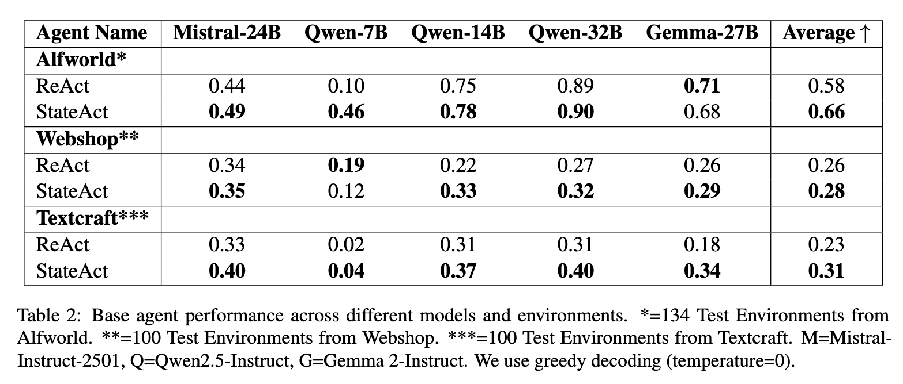

# StateAct Paper

This is the **OFFICIAL** implementation of the stateact paper:
[https://arxiv.org/abs/2410.02810]

---
## Getting started
Look in the "*_runs" sub-folders for **Detailed READMEs** for the invididual environments:

Environments for StateAct:
1. [Alfworld](/alfworld_runs)
2. [Webshop](/webshop_runs)
3. [Textcraft](/textcraft_runs)
      

---
## Results:


## Reference:
Please cite StateAct:
```bibtex
@article{rozanov2024stateactstatetrackingreasoning,
      title={StateAct: State Tracking and Reasoning for Acting and Planning with Large Language Models}, 
      author={Nikolai Rozanov and Marek Rei},
      year={2024},
      eprint={2410.02810},
      archivePrefix={arXiv},
      primaryClass={cs.AI},
      url={https://arxiv.org/abs/2410.02810}, 
}
```

## Known Follow-on Work / Usage:
- https://github.com/Humaid-Ibrahim/msc-ai-individual-project-agentic-ai-learning

---
(C) - Nikolai Rozanov 2024-Present
